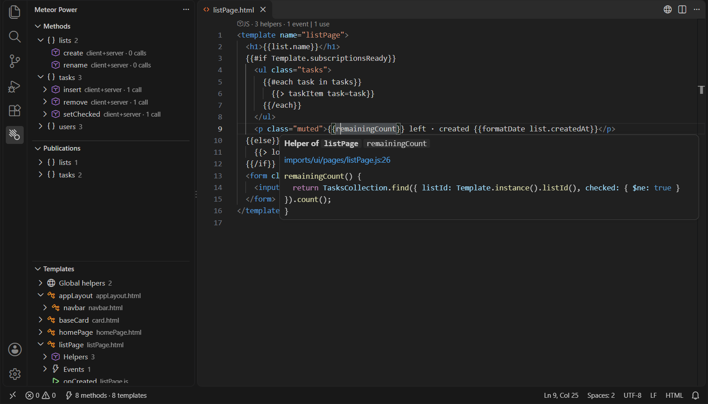
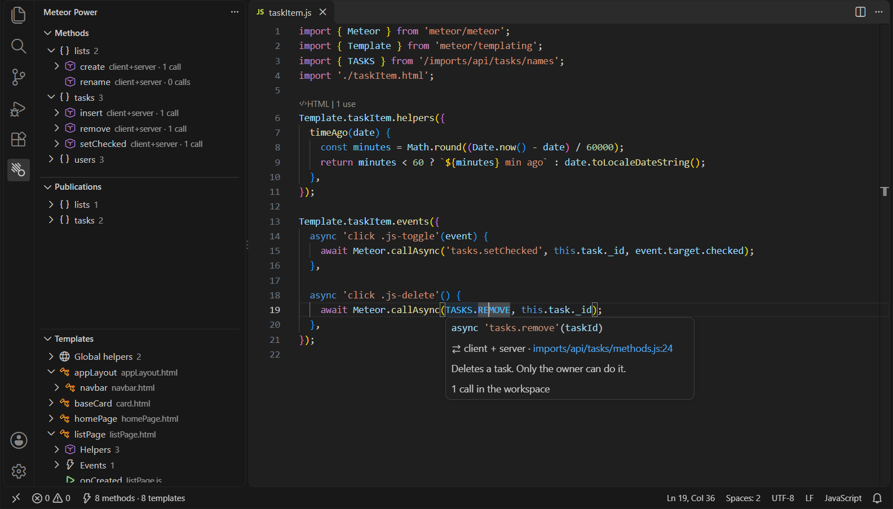
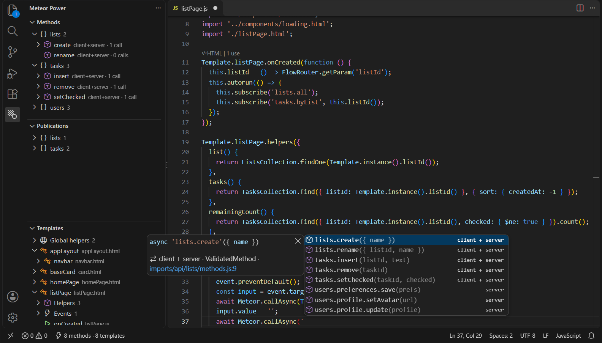
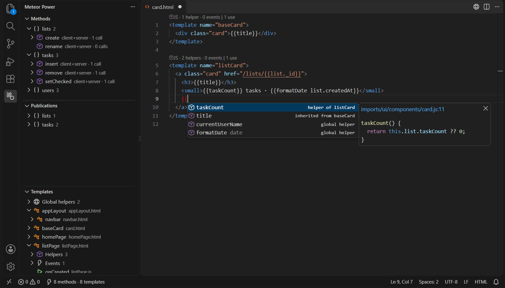
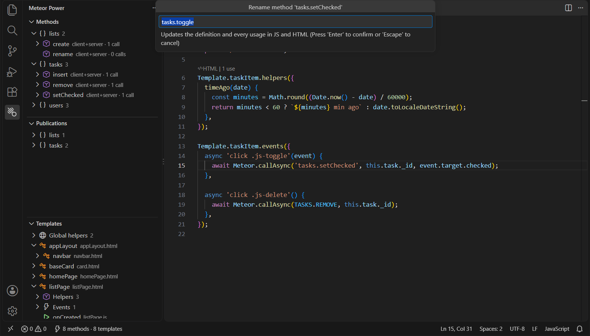
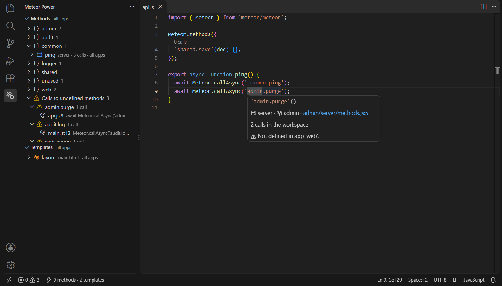

# Meteor Power

Navigate **Meteor 3** and **Blaze** projects as if names were real symbols instead of strings.

Meteor Power indexes the whole workspace and links things **by name**, so it works even when HTML, JS, methods and constants live in different folders.



## Methods and publications

| Where | What it does |
|---|---|
| `Meteor.call/callAsync/apply/applyAsync('name')` | **Ctrl+Click / F12** goes to the definition in `Meteor.methods` or `new ValidatedMethod({ name })` |
| `insertTask.call(...)`, `callAsync`, `Tasks.insertTask`, `insertTask.name` | calls through a **ValidatedMethod object** (also imported, aliased or via `import * as`) go to the method too |
| `Meteor.subscribe('name')`, `this.subscribe(...)` | goes to `Meteor.publish('name')`, including the object form |
| On a definition | **Ctrl+Click / Shift+F12** lists every call |
| Inside the string | **completion** of the names, with parameters and docs |
| Hover | signature, environment (server/client), file, JSDoc, number of calls |
| CodeLens | `N calls` above each method, `N subscriptions` above each publication |
| Diagnostics | warning on calls to undefined methods or publications |





Names can also be **constants**, resolved across the whole workspace:
`Meteor.callAsync(USERS_METHODS.RESET)`, `[USERS_METHODS.RESET]() {}`, TypeScript enums and `Object.freeze({...})`, also through
`import { USERS_METHODS as UM }`, `import * as C`, `import NAMES from './names'` (default export), `const { RESET } = USERS_METHODS`.

### Your own wrappers

If your project defines or calls methods through its own functions instead of `Meteor.methods` / `Meteor.callAsync`, list them in the settings and they are handled like the Meteor APIs:

```jsonc
// .vscode/settings.json
{
  "meteorPower.methods.defineFunctions": ["createMethod", "defineMethods"],
  "meteorPower.methods.callFunctions": ["callMethod"],
  "meteorPower.publications.defineFunctions": ["createPublication"],
  "meteorPower.publications.subscribeFunctions": ["useSubscribe"]
}
```

Supported shapes: `fn('name', handler)`, `fn('name', { run })`, `fn({ name: 'x', run() {} })`, `fn({ 'a.b'() {}, 'a.c'() {} })` and the same with `new`. Callers take the name as first argument, or `{ name: 'x' }`.
A bare name (`callMethod`) matches both `callMethod(...)` and `Api.callMethod(...)`; a full path (`Api.callMethod`) matches only that.

## Blaze

| Where | What it does |
|---|---|
| `{{helper}}` in HTML | goes to `Template.x.helpers({ helper })`, otherwise to `Template.registerHelper('helper')` |
| `{{> name}}`, `{{#name}}`, `{{> Template.dynamic template="name"}}` | goes to `<template name="name">` |
| `<template name="x">` | goes to the template JS (helpers, events, onCreated, …) |
| `Template.x` in JS | goes to the HTML |
| `BlazeLayout.render('layout', { main: 'page' })` | goes to the templates |
| Event map key `'click .js-save'` | goes to the elements with that class or id in the HTML |
| On a helper definition | finds where it is used in the HTML |
| Inside `{{ }}` | completion of the current template's helpers and the global ones; template names after `{{>` |
| **Alt+O** | switches between the HTML and the JS of the template |

Local variables (`{{#each item in items}}`, `{{#let}}`) and data context fields are never reported as errors.



### Template inheritance (aldeed:template-extension)

| Call | Effect |
|---|---|
| `Template.child.inheritsHelpersFrom('parent')` (or an array) | `{{helper}}` in `child` goes to the helper of `parent`; completion, references and rename follow it |
| `Template.child.inheritsEventsFrom('parent')` | the event selectors of `parent` also match the elements of `child` |
| `Template.child.replaces('parent')` | `child` uses the helpers and events of `parent` |
| `Template.base.copyAs('copy')` | `{{> copy}}` is a known template, going to the `copyAs` call; it has the helpers and events of `base` |

The template names inside these calls are navigable and renamed with the template.

## Rename (F2)

Press **F2** on a method, publication, template or helper, wherever it appears (definition, call, HTML), to rename it everywhere:

| Renaming | Updates |
|---|---|
| Method / publication | the definition and every call or subscription; if the name comes from a constant (`[USERS_METHODS.RESET]`, `import NAMES from ...`), the constant's string is renamed and the references keep working |
| Template | `<template name>`, `{{> x}}`, `{{#x}}…{{/x}}`, `Template.dynamic template="x"`, `Template.x` in JS, `BlazeLayout.render('x')` |
| Helper | the key in `Template.x.helpers` (or `Template.registerHelper`) and its usages in the template HTML (every template, for global helpers) |



Names that already exist are refused. Template and helper names must be valid identifiers.
The changes are left unsaved, like any rename in VS Code: review them and save with **Ctrl+K S** (*Save All*).

## Several apps in one workspace

Every folder containing `.meteor/release` is an app, and each file belongs to the apps that contain it:

- **Shared code linked into several apps** (symlinked folders) belongs to all of them: it is indexed once, and a method defined there exists in every app that links it. This relies on VS Code following symlinks in searches (`search.followSymlinks`, on by default).
- **Local packages** (folders with `package.js`, in `packages/` or anywhere in the workspace) belong to the apps listing them in `.meteor/packages`, directly or through other local packages (`api.use` / `api.imply`).
- Everything else outside the apps (e.g. a package nobody uses) is visible from every app.

Then everything is resolved inside the app of the file you are in: `Meteor.callAsync('x')` in app A goes to A's definition (or the shared one), never to app B's;
`{{> layout}}` and `{{title}}` find app A's template and helpers even when app B has templates with the same names; constants with the same name and different values in each app are resolved per app.

From shared code, everything of every app linking it is visible, and the diagnostics report names that are missing in **some** of those apps:
`Meteor method 'admin.purge' is not defined in app 'web'.` (the shared file runs in `web` too, where the call would fail).



Rename (F2) changes only the apps that use the name; if shared code uses it, all the apps linking that code are renamed together.

In the side panel the **filter** button (*Show App…*) shows the methods, publications and templates of a single app; with *All apps* each item shows the apps it is defined in.
Packages outside the workspace can be added with `meteorPower.packageDirs` (`METEOR_PACKAGE_DIRS` is read too).

## Side panel

The Meteor Power icon in the Activity Bar opens:

- **Methods**: a tree grouped by namespace (`users.profile.save` → users › profile › save), with environment, number of calls and the list of call sites. A separate group collects calls to undefined methods.
- **Publications**: same structure, with the subscriptions.
- **Templates**:
  - **hierarchical** view, i.e. the tree of `{{> …}}` inclusions
  - **flat** view
  - for each template: helpers, inherited helpers, events and lifecycle callbacks, buttons to open the HTML or the JS, and a group with the global helpers
- With several Meteor apps, a filter to show a single app.

Quick commands (Ctrl+Shift+P): *Meteor Power: Go to Method… / Go to Publication… / Go to Template…*.
**Ctrl+T** also finds methods, publications and templates.

## Settings

- `meteorPower.include` / `meteorPower.exclude`: which files to index. `public/` is excluded by default, because Meteor serves it as static files.
- `meteorPower.packageDirs`: folders of local packages outside the workspace (like `METEOR_PACKAGE_DIRS`).
- `meteorPower.methods.defineFunctions` / `callFunctions`, `meteorPower.publications.defineFunctions` / `subscribeFunctions`: your own wrappers, see above.
- `meteorPower.diagnostics.enabled`, `meteorPower.diagnostics.severity`: turn the reported problems on or off and choose their severity.
- `meteorPower.diagnostics.ignoreMethods` / `ignorePublications` / `ignoreTemplates`: names provided by packages that should not be reported. They support `*`, e.g. `"accounts.*"`.
- `meteorPower.codeLens.enabled`: show or hide the CodeLens.

## Large workspaces

Files are parsed on several worker threads: a workspace with 26,000 files is indexed in about 5 seconds.
Minified bundles and files over 1.5 MB are skipped.

If indexing is slow, run **Meteor Power: Show Log**: it lists how long each phase took, the slowest files and the
heaviest folders. Folders that are not Meteor code (generated files, vendored libraries) can be added to `meteorPower.exclude`.

## Development

```bash
npm install
npm test                  # unit tests on the core (parsers + index)
npm run test:integration  # tests inside VS Code (uses the installed VS Code)
npm run package           # builds meteor-power-<version>.vsix
npm run screenshots       # retakes the README screenshots from docs/demo (Windows)
node out/test/perf/run.js # indexing time on a large generated workspace (after npm run test:integration)
```

To debug it, open this folder in VS Code and press **F5**.
